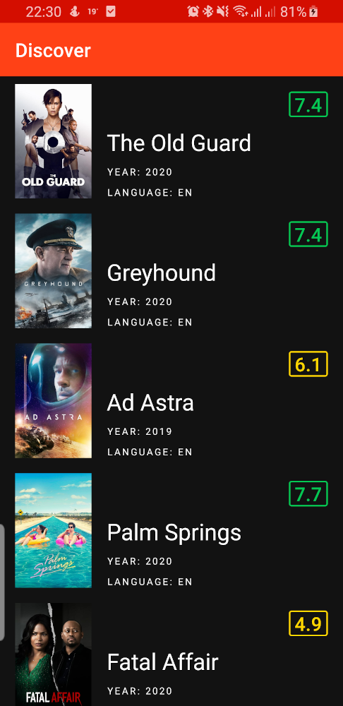
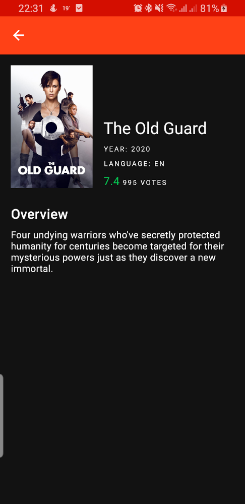

# WhatsToWatch

This is a showcase app using [themoviedb.org](https://developers.themoviedb.org/).
The app has just two screens, one screen with the list of movies and a second screen with detailed view of the movie detail.

## Screens
**Discover movies** / **Detail View** 

## Architecture
The project's code is organized first by feature and then by a clean architecture layer (i.e. **data**, **domain** and **presentation**). This means that first we have a feature, (e.g. Movies in this case) and then inside that feature we will have three packages, one for each clean architecture layer. There is also a comun package where shared code between features lives.

### Ui / Presentation layer
This layer is closest to what the user sees on the screen. And here we have the ViewModel, ViewState, ViewActions, UI Models and Fragment/Activity which should be only responsible for the view formatting any other logic should live in the domain layer.
To avoid inheritance the ViewModel's depend of a ViewStateStore interface. The purpose of this interface is to provide a standard way of communicating with the view as well to have a possibility of having it implemented by a default delegate.
**Currenty the DiscoverMoviesViewModel have an experimental implementation of Flows/Channels, this was done to quickly experiment how can we consume a ChannelFlow on a ViewModel, however the lifecycle implications of this aproach weren't fully explored yet.**

### Domain layer
This is the business logic layer of the application and it should be the independent of any other layers. This allows to make domain models and business logic independent from other layers. **Currently this layer just have domain models and 'dumb' UseCases.**

### Data layer
Manages application data and exposes these data sources as repositories to the domain layer. This layer is responsible for retrieving data from the internet and optionally cache this data locally. It's also relevant to note that this layer has its own models that will be then mapped to the domain layer models. **Currently a crude implementation of cache was implemented using room, this was done to explore the potential of the flow library. In this example DTO's from the api service are being used as room database models, this was done just to save some time.**

## Tests
This project was created to explore new technologies/architecture, so tests weren't done as thoroughly as they should. Currently the only parts tested are: DiscoverMovies UI logic, UseCases, DefaultImageUrl class.
To test the DiscoverMovies UI logic three kinds of tests were implemented, ViewModel unit tests, FragmentScenario tests, and a end to end test (The end to end test should test not only the DiscoverMovies screen but also the entire Movies feature).

 

## Tech-stack
This project is written in kotlin and takes advantage of many popular
libraries and tools of the Android ecosystem.
Some of the libraries used:
* [Room](https://developer.android.com/topic/libraries/architecture/room)
* [coil](https://github.com/coil-kt/coil)
* [squareup.moshi](https://github.com/square/moshi)
* [google.dagger](https://github.com/google/dagger)
* [coroutines/Flow](https://kotlinlang.org/docs/reference/coroutines-overview.html)
* [mockito](https://site.mockito.org/)
* [androidx.espresso](https://developer.android.com/training/testing/espresso/setup)

